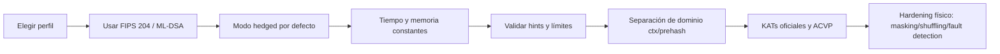

# Informe riguroso sobre CRYSTALS-Dilithium

## Resumen ejecutivo

CRYSTALS-Dilithium es una firma digital post-cuántica basada en retículas módulo, construida sobre el anillo $R_q=\mathbb Z_q[X]/(X^n+1)$ con $n=256$ y $q=8380417=2^{23}-2^{13}+1$, un primo elegido para habilitar una NTT completamente partida porque $q\equiv 1 \pmod{2n}=1 \pmod{512}$. La idea central es una identificación tipo Fiat–Shamir with Aborts: el firmante enmascara el secreto con un vector corto $y$, compromete sólo los **bits altos** de $w=Ay$, deriva un desafío disperso $c$, responde con $z=y+cs_1$, y **rechaza** toda salida que filtraría demasiado sobre $s_1,s_2$. Esa combinación da eficiencia, implementabilidad en tiempo constante y pruebas de seguridad ligadas a MLWE, MSIS y SelfTargetMSIS.

Hay que distinguir con mucho cuidado entre **CRYSTALS-Dilithium** y **ML-DSA**. ML-DSA en FIPS 204 está derivado de Dilithium 3.1, pero no es idéntico: NIST ajustó longitudes de variables internas, reforzó el manejo “hedged” de la aleatoriedad, restauró una validación de hints malformados y añadió separación de dominio explícita; por eso los RFCs de despliegue dejan claro que “ML-DSA y Dilithium no son compatibles”. Para estudiar la teoría conviene leer la especificación de Dilithium; para implementar o interoperar hoy, la referencia normativa es FIPS 204 y los RFC 9881/9882.

Los parámetros cumplen papeles muy precisos. $k,\ell$ fijan las dimensiones de la matriz pública $A\in R_q^{k\times \ell}$, y por tanto el tamaño de la instancia MLWE y de las instancias MSIS derivadas; $\eta$ controla el tamaño de los secretos $s_1,s_2$; $\tau$ fija el peso de Hamming del desafío $c$; $\beta=\tau\eta$ acota $\|cs_i\|_\infty$; $\gamma_1$ fija el rango del enmascaramiento $y$; $\gamma_2$ fija la granularidad de la descomposición en bits altos/bajos; $d$ dice cuántos bits bajos se descartan de $t$ en la clave pública; $\omega$ acota cuántos carries/hints se permiten en la firma. Cambiar cualquiera de ellos altera simultáneamente corrección, fugas, tasa de rechazo, dureza SIS/MLWE y tamaños de clave/firma.

En seguridad concreta, la literatura oficial modela la falsificación como suma de tres componentes: distinguir la clave pública de ruido/MLWE, resolver un problema de objetivo propio SelfTargetMSIS, y extraer una solución de tipo MSIS a partir de dos transcriptos o de una segunda firma fuerte. La reducción más citada para Dilithium da una cota del tipo

$$
\mathrm{Adv}^{\mathrm{sEUF\text{-}CMA}}_{\text{Dilithium}}(A)
\le
\mathrm{Adv}_{\mathrm{MLWE}}(B)+
\mathrm{Adv}_{\mathrm{SelfTargetMSIS}}(C)+
\mathrm{Adv}_{\mathrm{MSIS}}(D)+\text{términos despreciables},
$$

con parámetros $\zeta,\zeta'$ dependientes de $\gamma_1,\gamma_2,\tau,d,\beta$. La parte menos “limpia” conceptualmente es SelfTargetMSIS: la seguridad clásica se obtiene por forking/rebobinado, y la seguridad rigurosa en QROM ha requerido trabajos posteriores; una consecuencia importante es que las pruebas QROM totalmente rigurosas conocidas llevan a parámetros mucho más grandes que los del esquema práctico estandarizado.

En implementación, el riesgo real no es la matemática abstracta sino la física y la codificación: ya existen ataques de **traza única**, ataques por **rechazos filtrados**, y **fault attacks** prácticos contra implementaciones de Dilithium/ML-DSA en Cortex-M4 y otros entornos. Hay trabajos que recuperan la clave con una sola traza o unas pocas firmas; otros necesitan cientos, miles o millones de intentos/firmas pero siguen siendo prácticos si la fuga es estable. Por eso las reglas duras son: operaciones constantes en tiempo y memoria, protección de variables rechazadas, RNG robusto en modo hedged, validación estricta de hints y codificaciones, separación de dominio correcta, manejo disciplinado de semillas y uso de vectores oficiales de prueba.

## Estructura algebraica y flujo del esquema

Dilithium trabaja sobre

$$
R_q=\mathbb Z_q[X]/(X^n+1),
\qquad n=256,\quad q=8380417.
$$

La clave pública contiene una semilla $\rho$ de 32 bytes desde la cual se expande pseudorrandómicamente $A\in R_q^{k\times \ell}$, y una versión comprimida $t_1$ de

$$
t=As_1+s_2,
$$

donde $s_1\in R^\ell$ y $s_2\in R^k$ tienen coeficientes pequeños en $[-\eta,\eta]$. En la firma, el firmante deriva $\mu$ del mensaje y de un hash de la clave pública, genera $y\in R^\ell$ con coeficientes en $[-\gamma_1+1,\gamma_1]$, computa $w=Ay$, toma $w_1=\mathrm{HighBits}(w)$, calcula el desafío $c\in B_\tau$, responde con $z=y+cs_1$, y sólo acepta la firma si pasan las cotas sobre $z$, $r_0=\mathrm{LowBits}(w-cs_2)$, $\|ct_0\|_\infty$ y el número de hints. El verificador reconstruye una aproximación $w_1'$ de los bits altos usando $Az-c\,t_1 2^d$ y los hints.

Formalmente, las distribuciones relevantes son estas:

$$
S_\eta=\{f\in R_q:\text{todos los coeficientes de }f\text{ están en }[-\eta,\eta]\},
$$

$$
B_\tau=\{c\in R:\text{cada coeficiente es }-1,0,1\text{ y exactamente }\tau\text{ son no nulos}\},
$$

$$
y \leftarrow S_{\gamma_1-1}^{\ell}.
$$

La especificación moderna define $B_\tau$ exactamente así y muestrea $c$ por `SampleInBall`; define además `ExpandS` para $s_1,s_2$ con coeficientes en $[-\eta,\eta]$ y `ExpandMask` para $y$ con coeficientes entre $-\gamma_1+1$ y $\gamma_1$.

La razón de usar **sólo los bits altos** de $w$ no es cosmética: el verificador no conoce $t$ completo, sólo $t_1$, y además $cs_2$ y $ct_0$ pueden perturbar los bits bajos. Por eso el compromiso se hace sobre $w_1=\mathrm{HighBits}(w)$, con granularidad $\alpha=2\gamma_2$, y el firmante añade un vector de hints para que el verificador recupere correctamente esos bits altos pese a los carries producidos por $ct_0$. En otras palabras: **no se toman literalmente “los primeros $\gamma$ bits”**, sino la parte alta en la descomposición módulo $q$ con paso $2\gamma_2$. Esto reduce fuga, mantiene estable el compromiso frente a perturbaciones pequeñas y permite comprimir la clave pública.

El flujo completo puede verse así:

```mermaid
flowchart TD
    KG[KeyGen] --> A[ExpandA desde ρ]
    KG --> S[ExpandS para s1 y s2]
    A --> T[t = A s1 + s2]
    S --> T
    T --> C1[Power2Round: t -> t1,t0]
    C1 --> PK[pk = ρ || t1]
    C1 --> SK[sk = ρ || K || tr || s1 || s2 || t0]

    SK --> MU[μ = H(tr || M')]
    MU --> RHO2[ρ'' = H(K || rnd || μ)]
    RHO2 --> Y[ExpandMask -> y]
    Y --> W[w = A y]
    W --> W1[w1 = HighBits(w)]
    W1 --> CH[c~ = H(μ || w1Encode(w1))]
    CH --> BALL[c = SampleInBall(c~)]
    BALL --> Z[z = y + c s1]
    BALL --> R0[r0 = LowBits(w - c s2)]
    Z --> CHECK{normas e hints válidos}
    R0 --> CHECK
    CHECK -->|no| Y
    CHECK -->|sí| SIG[σ = (c~, z, h)]

    PK --> V1[Verificación]
    SIG --> V1
    V1 --> REC[w' = A z - c t1 2^d]
    REC --> HINT[UseHint -> w1']
    HINT --> HASH[recalcular c~']
    HASH --> OK{c~'=c~ y normas válidas}
```

La línea crítica para entender corrección y fuga es

$$
z=y+cs_1,\qquad r_0=\mathrm{LowBits}(w-cs_2),
$$

con las pruebas

$$
\|z\|_\infty<\gamma_1-\beta,
\qquad
\|r_0\|_\infty<\gamma_2-\beta.
$$

Si estas fallan, la firma se rechaza porque la salida sería demasiado dependiente del secreto.

## Parámetros del esquema y significado preciso

La tabla siguiente resume los parámetros “canónicos” del **Dilithium de ronda 3 / versión 3.1**; todos los valores y nombres provienen de la especificación oficial.

| Parámetro | Definición rigurosa | Papel |
|---|---|---|
| $n$ | grado del anillo $R_q=\mathbb Z_q[X]/(X^n+1)$ | determina la dimensión interna por polinomio; en Dilithium, $n=256$ fijo |
| $q$ | módulo primo del anillo | fija el espacio de coeficientes, la NTT y la granularidad de compresión |
| $k$ | número de **filas** de $A$ | dimensión del lado “muestras/ecuaciones”; tamaño de $s_2,t,t_1,t_0,h$ |
| $\ell$ | número de **columnas** de $A$ | dimensión del lado “secretos”; tamaño de $s_1,y,z$ |
| $\eta$ | cota de coeficientes de $s_1,s_2$ | controla distribución secreta y $\beta=\tau\eta$ |
| $\tau$ | peso de Hamming del desafío $c\in B_\tau$ | determina entropía del desafío y $\beta$ |
| $\beta$ | en ronda 3, $\beta=\tau\eta$ | cota práctica para $\|cs_i\|_\infty$; aparece en los checks |
| $\gamma_1$ | rango del enmascaramiento $y$ | balancea zero-knowledge, tasa de rechazo y tamaño de $z$ |
| $\gamma_2$ | rango de redondeo bajo; $\alpha=2\gamma_2$ | fija la descomposición $r=r_1\alpha+r_0$, la estabilidad de $w_1$ y los hints |
| $d$ | bits bajos descartados de $t$ | comprime la clave pública, pero hace crecer $t_0$ y el término SIS |
| $\omega$ | máximo número de unos en el hint $h$ | controla tamaño de firma y margen de corrección del reconstruido |
| $\rho$ | semilla pública para expandir $A$ | evita almacenar $A$ explícitamente |
| $\rho'$ | semilla privada para expandir $s_1,s_2$ | aleatoriedad de claves |
| $K$ | semilla privada usada al firmar | mezcla con $rnd$ y $\mu$ para obtener $\rho''$ |
| $\mu$ | representante hash del mensaje | entrada al desafío Fiat–Shamir |
| $t_1,t_0$ | descomposición de $t$ por `Power2Round` | $t_1$ va en pk; $t_0$ queda en sk |
| $c$ o $\tilde c$ | desafío disperso y su hash/semilla | desafío del verificador no interactivo |
| $h$ | hint de carries | ayuda al verificador a reconstruir $w_1$ |

Estas definiciones salen directamente de `ExpandA`, `ExpandS`, `ExpandMask`, `Power2Round`, `Decompose`, `HighBits`, `LowBits`, `MakeHint` y `UseHint` en FIPS 204, y son compatibles con la presentación matemática de Dilithium en las especificaciones del esquema.

Es útil fijar también dos identidades estructurales:

$$
t=As_1+s_2,\qquad
t = t_1\cdot 2^d + t_0 \pmod q,
$$

y, para la descomposición usada en la firma,

$$
r \equiv r_1\cdot (2\gamma_2) + r_0 \pmod q,
\qquad r_0\in[-\gamma_2,\gamma_2].
$$

`Power2Round` usa $2^d$; `Decompose` usa $2\gamma_2$. El primero comprime el public key; el segundo separa una parte alta estable que servirá como compromiso.

Las fórmulas de tamaño en la especificación de Dilithium 3.1 son lineales en $k,\ell,\omega$ y dependen de $d,\eta,\gamma_1$:

$$
|pk| = 32 + 320k \text{ bytes},
$$

$$
|sk| = 32+32+32+32\big((k+\ell)\lceil \log_2(2\eta+1)\rceil + 13k\big)\text{ bytes},
$$

$$
|\sigma| = 32\ell\,(1+\log_2\gamma_1)+\omega+k+32 \text{ bytes}.
$$

La intuición es inmediata: $k$ infla sobre todo la clave pública y la parte de hints; $\ell$ domina la parte $z$ de la firma; $d$ sólo aparece en la compresión de $t$; $\omega$ entra casi “a pelo” en bytes de hint.

## Efecto de cada parámetro sobre corrección, soundness, zero-knowledge y tamaños

### El papel de $k,\ell$ y de la matriz $A$

La matriz pública $A\in R_q^{k\times \ell}$ es el corazón del esquema. Algebraicamente, es la instancia pública sobre la que se apoyan tanto la **indistinguibilidad** tipo MLWE de $t=As_1+s_2$ como la **extracción** tipo MSIS de un vector corto en el “kernel” de $[I\mid A]$ o de $[A\mid t]$. La propia especificación explica que una instancia $\mathrm{MLWE}_{\ell,k,D}$ puede verse como una instancia LWE de dimensión de secreto $256\ell$ y número de muestras $256k$, y que las instancias MSIS/SIS correspondientes viven en dimensiones $256k\times 256(\ell+1)$ o $256k\times 256\ell$.

De ahí sale una observación importante. **Aumentar $\ell$** aumenta la dimensión del secreto y el tamaño de $s_1,y,z$; eso tiende a elevar el coste de ataques de retículas y de enumeración de secretos pequeños, pero encarece bastante la firma porque $z\in R^\ell$ domina el tamaño de $\sigma$. **Aumentar $k$** añade ecuaciones/muestras y crece el tamaño de $s_2,t,h$; eso incrementa el coste algebraico por firma/verificación y hace crecer la clave pública, pero también endurece la parte MSIS porque añade restricciones lineales. En cambio, en la parte MLWE, más filas equivalen a más muestras; para un atacante eso nunca empeora, y por eso en los análisis concretos se permite incluso elegir sólo un subconjunto $m\le 256k$ de filas. En resumen: $k$ y $\ell$ no “suben la seguridad” de manera monótona y aislada; se eligen conjuntamente para equilibrar MLWE, MSIS, rechazo y tamaños. Esa conclusión es una inferencia directa de las definiciones y del mapeo a LWE/SIS que hace la especificación.

También conviene aclarar una confusión frecuente sobre “la entropía de $A$”. El esquema **no** almacena $k\ell n\log_2 q$ bits aleatorios independientes para $A$, sino una semilla pública $\rho\in\{0,1\}^{256}$ desde la que `ExpandA` deriva cada entrada con separación de dominio por fila y columna. Cambiar $k,\ell$ cambia el volumen de salida pseudorrandómica y el coste de expansión, pero la entropía real inyectada en la generación de $A$ sigue siendo la de $\rho$, o sea 256 bits.

### El papel de $\eta,\tau,\beta$

$\eta$ controla el rango secreto de $s_1,s_2$, y $\tau$ el número de posiciones no nulas del desafío $c$. En ronda 3, la tabla de parámetros hace explícito que $\beta=\tau\eta$. Eso es exactamente la cota que se quiere para $\|cs_1\|_\infty$ y $\|cs_2\|_\infty$, porque cada coeficiente de $cs_i$ es suma de a lo sumo $\tau$ coeficientes de magnitud a lo sumo $\eta$. Por eso los checks de la firma usan $\gamma_1-\beta$ y $\gamma_2-\beta$.

Si se aumenta $\eta$, los secretos tienen más entropía por coeficiente y resultan menos “estrechos”, lo cual puede ser bueno frente a algoritmos especializados para secretos muy estrechos; pero sube $\beta$, y eso empeora la tasa de aceptación a menos que se compensen $\gamma_1,\gamma_2$. Si se aumenta $\tau$, sube la entropía del desafío $c$ y mejora la soundness del Fiat–Shamir with Aborts, pero también sube $\beta$, aumenta el coste de multiplicar por $c$ y endurece los checks. La entropía del desafío en ronda 3 se da explícitamente como $\log_2 \binom{256}{\tau}+\tau$, con valores 192, 225 y 257 bits para niveles 2, 3 y 5.

Hay además un matiz criptanalítico moderno: trabajos recientes estudian ataques de enumeración/representación para secretos LWE tan estrechos como los de Kyber y Dilithium, precisamente en regímenes $\eta\le 3$. No implican que los parámetros oficiales estén rotos, pero sí muestran que bajar $\eta$ sin rediseñar el resto del esquema sería un cambio delicado.

### El papel de $\gamma_1$ y $\gamma_2$

$\gamma_1$ manda sobre el masking vector $y$. Si $\gamma_1$ es demasiado pequeño, entonces $z=y+cs_1$ deja de parecer una muestra “centrada” y la salida firma empieza a revelar demasiado de $s_1$; si $\gamma_1$ es demasiado grande, la firma crece porque $z$ necesita más bits por coeficiente y, además, los márgenes de falsificación por MSIS empeoran. La propia presentación original resume esta tensión diciendo que $\gamma_1$ debe ser lo bastante grande para que la firma sea zero-knowledge y lo bastante pequeña para que no sea fácil forjarla.

$\gamma_2$, en cambio, fija la escala $\alpha=2\gamma_2$ de la descomposición

$$
r \equiv r_1 \alpha + r_0 \pmod q.
$$

Con $\gamma_2$ grande, la parte baja $r_0$ absorbe más perturbación y es más fácil que los bits altos permanezcan estables, lo que ajuda a corrección y a reducir hints/rechazos; pero entonces hay **menos** bits altos distintos, porque $(q-1)/(2\gamma_2)$ baja, y el compromiso queda más grueso. Con $\gamma_2$ pequeño ocurre lo contrario: cuantización más fina, más bits altos distinguibles, pero más sensibilidad a carries y más presión sobre $\omega$ y sobre la cota $\|r_0\|_\infty<\gamma_2-\beta$.

En términos de fuga, la razón para usar `HighBits` es que los bits bajos son precisamente donde impactan $cs_2$ y $ct_0$. La estabilidad buscada es:

$$
\|cs_2\|_\infty\le \beta,\qquad \|r_0\|_\infty<\gamma_2-\beta
\;\Longrightarrow\;
\mathrm{HighBits}(w-cs_2)=\mathrm{HighBits}(w)=w_1.
$$

Eso es lo que evita que el compromiso hash “vea” directamente la parte más sensible del cómputo.

### El papel de $d$ y $\omega$

$d$ controla cuántos bits bajos se tiran de $t$ al construir la clave pública: si un coeficiente completo precisaría $\lceil\log_2 q\rceil$ bits, tras `Power2Round` la parte pública necesita $\lceil\log_2 q\rceil-d$. Eso comprime el pk, pero deja un $t_0$ más grande en la clave secreta, y por tanto aumenta el término $ct_0$ que aparece en la reducción a SelfTarget/MSIS. La especificación de ronda 3 dice expresamente que pasar de $d=14$ a $d=13$ aumentó la dureza SIS a costa de un pk ligeramente mayor.

$\omega$ fija el número máximo de carries/hints enviados. Matemáticamente, los hints indican en qué coeficientes la suma con la corrección cambia los bits altos. En tamaño de firma, el coste aparece casi linealmente: la firma contiene $\omega+k$ bytes para la codificación de hints, además del bloque de $z$ y del hash del desafío. Si $\gamma_2$ o $d$ hacen más frecuentes los carries, habrá que subir $\omega$ o aceptar más rechazos.

## Rechazo, corrección y reducciones de seguridad

La matemática práctica del rechazo está muy bien resumida en la derivación clásica de Dilithium. Si se modela coeficiente a coeficiente, la probabilidad de pasar el check de $z$ es

$$
\Pr\big[\|z\|_\infty<\gamma_1-\beta\big]
=
\left(\frac{2(\gamma_1-\beta)-1}{2\gamma_1-1}\right)^{n\ell}
\approx
e^{-n\beta\ell/\gamma_1},
$$

y, bajo la heurística de uniformidad de bits bajos, la probabilidad de pasar el check de $r_0$ es

$$
\Pr\big[\|r_0\|_\infty<\gamma_2-\beta\big]
=
\left(\frac{2(\gamma_2-\beta)-1}{2\gamma_2}\right)^{nk}
\approx
e^{-n\beta k/\gamma_2}.
$$

Por tanto, la probabilidad total de aceptar un intento se aproxima por

$$
p_{\mathrm{acc}}
\approx
e^{-n\beta(\ell/\gamma_1+k/\gamma_2)}.
$$

Ésa es la ecuación base usada para estimar el número esperado de repeticiones.

La corrección no tiene “failure probability” al estilo de un KEM con decryption failures: el verificador acepta siempre una firma **válida** producida por el algoritmo, y el costo probabilístico está en que el firmante puede requerir varios intentos antes de emitir una firma. En el diseño original se calibró además que el chequeo posterior ligado a hints falle con probabilidad heurísticamente inferior al 1%, así que la gran mayoría de los rechazos provienen de las cotas sobre $z$ y $r_0$. En FIPS 204 se permite incluso poner un máximo de iteraciones y devolver error si se excede, siempre borrando intermedios.

La reducción de seguridad clásica/estándar usa tres problemas. La definición de MLWE para Dilithium es distinguir $(A,t)$ aleatorio de $(A,As_1+s_2)$ con $s_1,s_2$ pequeños; MSIS es encontrar un vector no nulo y corto en el kernel de $[I\mid A]$; SelfTargetMSIS incorpora además la ecuación hash-del-objetivo. La cota de seguridad original se expresa como

$$
\mathrm{Adv}^{\mathrm{SUF\text{-}CMA}}
\le
\mathrm{Adv}_{\mathrm{MLWE}}
+
\mathrm{Adv}_{\mathrm{SelfTargetMSIS}}
+
\mathrm{Adv}_{\mathrm{MSIS}}
+
2^{-254},
$$

y, en la reformulación más moderna, como una cota sEUF-CMA comparable:

$$
\mathrm{Adv}^{\mathrm{sEUF\text{-}CMA}}_{\text{Dilithium}}
\le
\mathrm{Adv}_{\mathrm{MLWE}}
+
\mathrm{Adv}_{\mathrm{SelfTargetMSIS}}
+
\mathrm{Adv}_{\mathrm{MSIS}}
+\text{términos despreciables}.
$$

El mensaje práctico es que ninguna falsificación convincente aparece “de la nada”: o distingues la clave pública como MLWE, o resuelves una instancia SelfTargetMSIS, o extraes una solución corta de tipo MSIS.

Los parámetros concretos de la reducción dependen de

$$
\zeta \approx \max\{\gamma_1-\beta,\ \tau 2^{d-1}+2\gamma_2+1\},
\qquad
\zeta' \approx \max\{2(\gamma_1-\beta),\ 4\gamma_2+2\},
$$

porque una falsificación nueva da lugar a una solución corta del tipo

$$
Az+u_0=t_0,
\qquad
\|z\|_\infty<\gamma_1-\beta,
\qquad
\|u_0\|_\infty\le \tau 2^{d-1}+2\gamma_2+1,
$$

y la **strong unforgeability** añade el caso de dos firmas distintas del mismo mensaje, que implica un vector corto en el kernel homogéneo con cota $\|z\|_\infty\le 2(\gamma_1-\beta)$ y $\|u\|_\infty\le 4\gamma_2+2$. Eso muestra exactamente cómo $d,\tau,\gamma_2,\gamma_1,\beta$ inflan o aprietan el lado SIS de la seguridad.

En QROM, la sutileza es SelfTargetMSIS. El trabajo de Jackson, Miller y Wang muestra que era precisamente la pieza menos clara, y da la primera prueba de dureza de SelfTargetMSIS a partir de MLWE en el modelo cuántico de oráculo aleatorio. Pero el precio es importante: para obtener una prueba QROM rigurosa sobre el régimen $q\equiv 1\pmod{2n}$, los parámetros resultantes acaban siendo aproximadamente $2.9\times$ más grandes en clave pública y $1.3\times$ más grandes en firma que los parámetros prácticos propuestos en la línea de Kiltz–Lyubashevsky–Schaffner. Ésta es una de las razones por las que el esquema desplegado mezcla prueba rigurosa, análisis concreto y heurística criptanalítica estándar.

## Ataques conocidos y superficie real de riesgo

### Ataques de retículas sobre MLWE y MSIS

En el análisis oficial de ronda 3, la dureza concreta se estima mapeando MLWE/MSIS a LWE/SIS de dimensión $256\ell$, $256k$ y usando ataques de retículas —primal, dual y BKZ/sieving— sin explotar estructura módulo adicional. Para los parámetros de ronda 3, las tablas oficiales reportan para la parte LWE costes “Core-SVP” clásicos de 123, 182 y 252 bits, y para la parte SIS costes clásicos al menos comparables o superiores; además, la especificación subraya que no se conocen ataques que exploten la estructura de módulo mejor que tratar el problema como LWE/SIS no estructurado.

Eso no significa que la parte de secretos pequeños sea irrelevante. Hay investigación activa en ataques especializados para claves LWE estrechas, incluyendo regímenes “as narrow as in Kyber/Dilithium”. No rompen los parámetros oficiales actuales, pero sí son una advertencia directa contra cambios caseros en $\eta$, $k,\ell$ o en la distribución secreta sin reestimar toda la seguridad.

### Ataques de canal lateral

Los canales laterales son hoy la familia de ataques más convincente contra implementaciones reales. Un trabajo de 2023 muestra un ataque de **traza única** sobre el desempaquetado de la clave secreta en Dilithium-2 sobre ARM Cortex-M4: con una fase de perfilado de menos de 10 horas, una sola traza da una probabilidad no despreciable de recuperación completa de $s_1$, y con múltiples trazas la tasa de éxito se acerca al 100%; además, una variante del ataque reconstruye el resto del secreto resolviendo ecuaciones derivadas de $t=As_1+s_2$.

Otro trabajo de 2024, también práctico, informa que en Dilithium2 sobre STM32F4 pueden obtenerse recuperaciones de clave con **dos firmas** en unos cinco minutos, y que con **una sola firma** la probabilidad de recuperación puede llegar al 60% en una hora. Ese ataque explota la operación $z=y+cs_1$ con perfilado sobre $y$ o sobre $cs_1$, y luego resuelve el sistema ruidoso correspondiente.

Un tercer frente, muy importante, apunta al propio **rejection sampling**. El trabajo de 2025 sobre “Rejected Signatures’ Challenges” modela la recuperación de clave como un problema ILP a partir de respuestas rechazadas y de los desafíos correspondientes. Para los tres niveles de seguridad, reporta recuperación del secreto “en segundos o minutos” con éxito del 100%, usando aproximadamente $3\times 10^6$, $2.3\times 10^7$ y $1.3\times 10^7$ generaciones de firma para niveles 2, 3 y 5, respectivamente, y demuestra la extracción de esa información desde fugas de una sola traza en operaciones NTT y de generación de respuesta.

Finalmente, la literatura sobre fugas de aleatoriedad deja muy claro que las firmas tipo Fiat–Shamir with Aborts son sensibles a la exposición parcial del enmascaramiento. Ya en 2019 se mostró teóricamente que fugas parciales de randomness pueden conducir a recuperación de clave; en 2022 se llevaron estas ideas a ataques de plantilla pública prácticos sobre implementaciones reales de Dilithium, incluyendo variantes enmascaradas.

### Fault attacks

También hay ataques por fallos ya muy concretos. En 2024, “Correction Fault Attacks on Randomized CRYSTALS-Dilithium” mostró dos ataques de recuperación de clave contra la variante **hedged/randomized**, justo la que NIST dejó por defecto. Para Dilithium2, los autores reportan recuperación con tan sólo **1024** o **512 firmas defectuosas**, cada una obtenida con una única inyección de fallo dirigida.

En 2025, “Finding a Polytope” llevó el tema más allá: describe un ataque práctico contra Dilithium debilitando el rejection sampling y, según su resumen publicado, unas pocas omisiones de instrucciones bastan para reducir parte del problema desde una instancia MLWE a una RLWE más pequeña y resoluble con reducción de retículas. La moraleja es fuerte: ni siquiera el modo hedged protege si la implementación deja objetivos de fallo accesibles dentro de la lógica de rechazo o en la expansión/uso de $A$.

### Reutilización de nonces y errores de estado

Dilithium no expone un “nonce” de usuario al estilo DSA/ECDSA, pero internamente sí usa enmascaramientos $y$ frescos derivados de $\rho''$ y del contador $\kappa$. Si por un bug se repitiera el mismo $y$ en dos firmas distintas, entonces

$$
z_1-z_2=(c_1-c_2)s_1,
$$

lo que daría relaciones lineales extremadamente peligrosas sobre $s_1$. Esto no es un ataque publicado contra el diseño estándar —que precisamente deriva $\rho''$ de $K$, $rnd$ y $\mu$, y avanza $\kappa$ en cada intento—, pero sí es una inferencia inmediata de la ecuación de firma y una cautela de implementación crítica.

Hay además una cautela menos obvia: en modo completamente determinista, el número de abortos depende del mensaje, así que el tiempo total de firma puede filtrar información sobre el mensaje aunque no filtre la clave. La especificación 3.1 lo advierte explícitamente y por eso, en despliegues duros, el modo hedged suele ser preferible.

## Recomendaciones de implementación segura

La especificación de Dilithium 3.1 afirma que la implementación de referencia evita bifurcaciones y accesos a memoria dependientes de secretos, y recomienda incluso evitar el operador `%` de C para reducciones modulares. Ése es el punto de partida mínimo: todas las operaciones sobre $s_1,s_2,t_0,y,z,r_0,h$ deben ejecutarse en tiempo constante y con patrones de memoria independientes de datos secretos. En particular, la lógica de `MakeHint`, `UseHint`, `BitPack/Unpack`, NTT y reducciones Montgomery/Barrett debe escribirse sin ramas secretas ni accesos indexados por secretos.

La aleatoriedad debe seguir el modelo **hedged** de FIPS 204: la firma estándar genera $rnd\in\{0,1\}^{256}$ desde un RBG aprobado y luego deriva $\rho''=H(K\|rnd\|\mu)$. El modo determinista existe, pero es opcional. En implementaciones certificables, el valor $rnd$ debe nacer dentro del módulo criptográfico y las interfaces internas que permiten fijarlo no deben exponerse a aplicaciones salvo para pruebas controladas.

La validación de entradas no es “higiene”; es parte de la seguridad formal. FIPS 204 restauró expresamente una comprobación de **hint malformado** cuya omisión hacía que el esquema dejara de ser fuertemente infalsificable. En verificación, por tanto, hay que: decodificar estrictamente la firma, rechazar hints malformados, verificar $\|z\|_\infty<\gamma_1-\beta$, comprobar que $h$ tiene a lo sumo $\omega$ unos, y sólo entonces comparar el hash del compromiso reconstruido.

También conviene imponer límites robustos a los procedimientos de muestreo pseudoaleatorio. FIPS 204 da cotas explícitas para `RejNTTPoly` y `SampleInBall`: después de 298 llamadas a `G.Squeeze`, la probabilidad de no haber reunido suficientes coeficientes válidos en `RejNTTPoly` cae por debajo de $2^{-256}$; para `SampleInBall`, el documento da un límite práctico de 221 bytes extraídos de `H`, y exige que una implementación que adopte ese límite devuelva un error constante, destruya intermedios y no filtre ningún otro dato.

La separación de dominio debe seguir la norma, no intuiciones caseras. En FIPS 204, `ML-DSA.Sign` y `HashML-DSA.Sign` distinguen explícitamente los casos “pure” y “pre-hash” construyendo $M'$ con prefijos y contexto; además RFC 9881/9882 sólo estandarizan ciertos usos de la variante pura en PKIX y CMS. No conviene mezclar formatos, OIDs, wrappers ASN.1 ni asumir compatibilidad binaria entre Dilithium legado y ML-DSA.

Sobre el manejo de claves, hay dos formatos razonables: semilla de 32 bytes o clave expandida. RFC 9881 recomienda el formato semilla cuando el entorno ASN.1 lo soporta, porque permite rederivar clave privada y pública, pero eso **no** reduce la sensibilidad: quien robe la semilla roba toda la clave. En HSM, TEEs o firmware seguros, lo correcto es tratar semilla y clave expandida como materiales equivalentes en criticidad, con ceroización fuerte tras uso.

Los vectores de prueba oficiales existen y deben usarse. El software oficial de CRYSTALS incluye programas `PQCgenKAT_sign*`, `test_vectors*` y `test_dilithium*`; además NIST mantiene pruebas ACVP/CAVP para ML-DSA. Una implementación seria debería validar: compatibilidad con KATs oficiales, vectores de intermedios (`A`, `s`, `y`, `w_1`, `w_0`, `t_1`, `t_0`, `c`), pruebas negativas de firmas alteradas y tests de serialización ASN.1 si se expone PKIX/CMS.

Una vista operativa del camino seguro de despliegue sería ésta:



## Tablas comparativas de parámetros

### Conjuntos históricos Dilithium-I, II, III, IV

La siguiente tabla corresponde a la nomenclatura **histórica** de la especificación/paper original y de la ronda 2, donde I/II/III/IV se alineaban con “weak/medium/recommended/very high”. No son los conjuntos hoy estandarizados por FIPS 204, pero siguen siendo la mejor referencia para entender la evolución del diseño. Todos los valores de la tabla proceden de la tabla 1/2 del paper y de la especificación round-2.

| Conjunto histórico | Nivel NIST histórico | $(k,\ell)$ | $q$ | $d$ | $\tau$ | $\eta$ | $\beta$ | $\gamma_1$ | $\gamma_2$ | $\omega$ | pk (B) | sig (B) | reps. esperadas | rechazo esperado |
|---|---:|---:|---:|---:|---:|---:|---:|---:|---:|---:|---:|---:|---:|---:|
| Dilithium-I | — | (3,2) | 8380417 | 14 | 60 | 7 | 375 | 523776 | 261888 | 64 | 896 | 1387 | 4.3 | 76.7% |
| Dilithium-II | 1 | (4,3) | 8380417 | 14 | 60 | 6 | 325 | 523776 | 261888 | 80 | 1184 | 2044 | 5.9 | 83.1% |
| Dilithium-III | 2 | (5,4) | 8380417 | 14 | 60 | 5 | 275 | 523776 | 261888 | 96 | 1472 | 2701 | 6.6 | 84.8% |
| Dilithium-IV | 3 | (6,5) | 8380417 | 14 | 60 | 3 | 175 | 523776 | 261888 | 120 | 1760 | 3366 | 4.3 | 76.7% |

La columna “rechazo esperado” se ha calculado como $1-1/\mathbb E[\text{repeticiones}]$, a partir de la tabla oficial de repeticiones esperadas.

### Conjuntos Dilithium de ronda 3 y su legado en ML-DSA

La ronda 3 sustituyó I/II/III/IV por conjuntos para niveles 2, 3 y 5, con $(k,\ell)=(4,4),(6,5),(8,7)$, $\tau\in\{39,49,60\}$, $d=13$ y valores de $\eta,\beta,\gamma_1,\gamma_2,\omega$ reajustados. La tabla inferior mezcla la **parametrización round-3/3.1** con los tamaños **ML-DSA** ya normalizados donde corresponde; esto es útil porque los parámetros algebraicos vienen de Dilithium, pero el despliegue actual usa ML-DSA-44/65/87. Los valores de tamaños ML-DSA provienen de RFC 9881 Appendix B.

| Conjunto práctico | Alias NIST/FIPS | $(k,\ell)$ | $\eta$ | $\tau$ | entropía de $c$ | $\beta$ | $\gamma_1$ | $\gamma_2$ | $\omega$ | reps. esperadas | rechazo esperado | pk (B) | sig (B) |
|---|---|---:|---:|---:|---:|---:|---:|---:|---:|---:|---:|---:|---:|
| Dilithium2 | ML-DSA-44 | (4,4) | 2 | 39 | 192 bits | 78 | $2^{17}$ | $(q-1)/88$ | 80 | 4.25 | 76.5% | 1312 | 2420 |
| Dilithium3 | ML-DSA-65 | (6,5) | 4 | 49 | 225 bits | 196 | $2^{19}$ | $(q-1)/32$ | 55 | 5.1 | 80.4% | 1952 | 3309 |
| Dilithium5 | ML-DSA-87 | (8,7) | 2 | 60 | 257 bits | 120 | $2^{19}$ | $(q-1)/32$ | 75 | 3.85 | 74.0% | 2592 | 4627 |

Las tasas de rechazo de esta tabla se han calculado igual que antes, como $1-1/\mathbb E[\text{repeticiones}]$, usando las repeticiones oficiales de ronda 3.

### Lectura rápida de la evolución de parámetros

Lo más revelador del paso I–IV a 2/3/5 es esto. Primero, $d$ baja de 14 a 13 para reforzar la parte SIS. Segundo, $\tau$ baja en niveles 2 y 3, reduciendo $\beta$ y la tasa de rechazo. Tercero, $(k,\ell)$ se reequilibran: el conjunto de nivel 2 pasa a matriz $4\times 4$, y el de nivel 5 se lleva a $8\times 7$. Cuarto, $\gamma_1$ se hace mucho mayor en niveles altos de ronda 3, lo que ayuda a mantener la propiedad zero-knowledge con los nuevos $\eta,\tau,\beta$, aunque encarece la codificación de $z$.

## Cronología operativa de firmado y verificación

La siguiente vista resume de forma temporal qué sucede y dónde están los puntos delicados de seguridad. Está basada en los algoritmos internos y externos de FIPS 204.

```mermaid
flowchart TD
    T1[Formatear mensaje con contexto] --> T2[Hash de pk -> tr]
    T2 --> T3[μ = H(tr || M')]
    T3 --> T4[Generar rnd o usar 0 determinista]
    T4 --> T5[ρ'' = H(K || rnd || μ)]
    T5 --> T6[Loop de rechazo]
    T6 --> T7[ExpandMask -> y]
    T7 --> T8[w = A y ; w1 = HighBits(w)]
    T8 --> T9[c~ = H(μ || w1Encode(w1))]
    T9 --> T10[c = SampleInBall(c~)]
    T10 --> T11[z = y + c s1 ; r0 = LowBits(w - c s2)]
    T11 --> T12{checks de norma e hints}
    T12 -->|falla| T6
    T12 -->|pasa| T13[Emitir σ=(c~,z,h)]
    T13 --> T14[Verificador reconstruye w1']
    T14 --> T15[Recalcula c~']
    T15 --> T16[Acepta sólo si todo coincide]
```

Los puntos más sensibles desde el punto de vista de implementación son el **loop de rechazo** —porque las firmas rechazadas contienen sesgo estadístico y pueden generar fugas laterales—, la codificación/decodificación de hints, y las operaciones NTT/punto a punto sobre $s_1,s_2,t_0$. Ésos son precisamente los lugares donde se concentran los trabajos de canal lateral y fault injection más exitosos de los últimos años.
